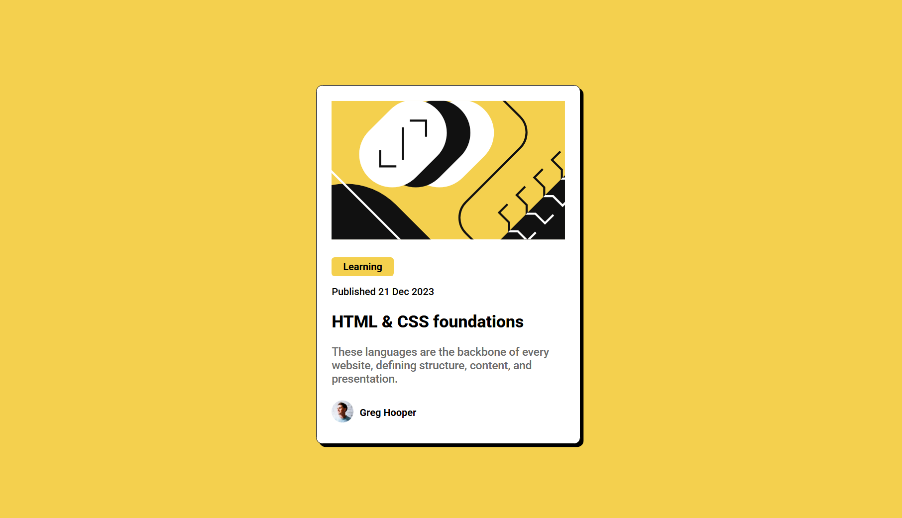

# Frontend Mentor - Blog preview card solution

This is a solution to the [Blog preview card challenge on Frontend Mentor](https://www.frontendmentor.io/challenges/blog-preview-card-ckPaj01IcS). Frontend Mentor challenges help you improve your coding skills by building realistic projects. 

## Table of contents

- [Overview](#overview)
  - [The challenge](#the-challenge)
  - [Screenshot](#screenshot)
- [My process](#my-process)
  - [Built with](#built-with)
  - [What I learned](#what-i-learned)
  - [Continued development](#continued-development)
- [Author](#author)

## Overview

### The challenge

Users should be able to:

- See hover and focus states for all interactive elements on the page

✅ See hover and focus states for all interactive elements on the page.
✅ Experience a fully responsive design on different screen sizes.
✅ View a structured, well-styled blog preview card.


### Screenshot




## My process

### Built with

- ✅ Semantic HTML5 markup
- ✅ CSS custom properties
- ✅ Flexbox
- ✅ Mobile-first workflow


### What I learned

Semantic HTML: Implementing <article>, <time>, and improving accessibility.
🔹 Flexbox: Proper alignment of elements without unnecessary display: flex; usage.

To see how you can add code snippets, see below:


```css
.card {
    max-width: 375px;
    width: 100%;
    padding: 24px;
    border-radius: 10px;
    box-shadow: 5px 5px 10px rgba(0, 0, 0, 0.2);
}
```

### Continued development

In future projects, I want to:
🔹 Explore CSS Grid for more complex layouts.
🔹 Improve animations and transitions for a smoother UI.
🔹 Experiment with JavaScript to add interactivity to blog previews.


## Author

- Frontend Mentor - [@JoaoVitor3011](https://www.frontendmentor.io/profile/JoaoVitor3011)

